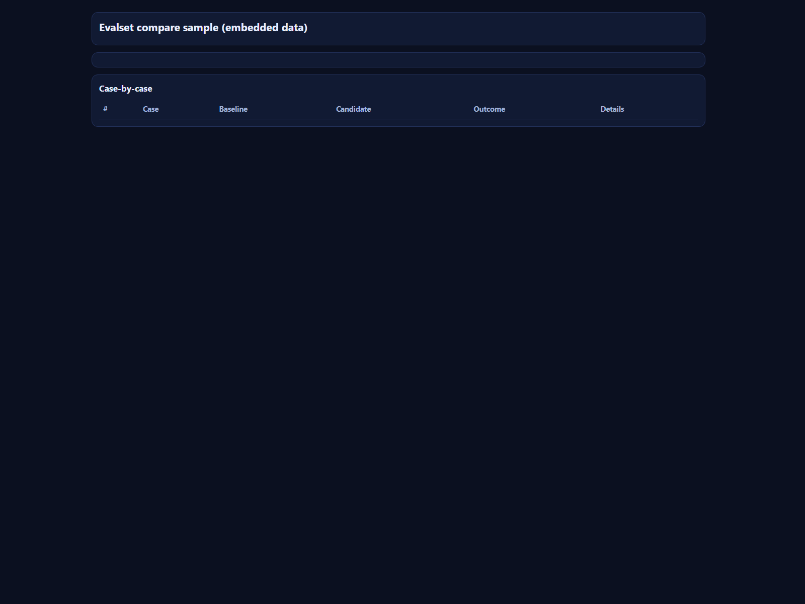

# pi-evalset-lab

Extension package for fixed-task-set eval workflows in pi (`/evalset run|compare`) with reproducible JSON reports.

Primary category fit: **Model & Prompt Management**, **Review & Quality Loops**, **UX & Observability**, **Safety & Governance**.

## Quickstart

1. Install dependencies (if you add any):

   ```bash
   npm install
   ```

2. Test with pi:

   ```bash
   pi -e ./extensions/evalset.ts
   ```

3. Install package into pi:

   ```bash
   pi install /absolute/path/to/pi-evalset-lab
   ```

## Runtime dependencies and packaged files

This extension depends on pi host APIs and declares them as `peerDependencies`:

- `@mariozechner/pi-coding-agent`
- `@mariozechner/pi-ai`

In normal usage, pi provides these at runtime when loading the package.

The npm package also uses a `files` whitelist so required runtime artifacts are explicitly included:

- `extensions/evalset.ts`
- `prompts/`
- `examples/` (sample datasets + sample report UI)

## Category taxonomy (reference)

Keyword slugs used for extension categorization:

- `ux-observability` (UX & Observability)
- `safety-governance` (Safety & Governance)
- `context-codebase-mapping` (Context & Codebase Mapping)
- `web-docs-retrieval` (Web & Docs Retrieval)
- `background-processes` (Background / Long-running Processes)
- `review-quality-loops` (Review & Quality Loops)
- `planning-orchestration` (Planning & Orchestration)
- `subagents-parallelization` (Subagents / Parallelization)
- `model-prompt-management` (Model & Prompt Management)
- `interactive-clis-editors` (Interactive CLIs / Editors)
- `skills-rules-packs` (Skills & Rules Packs)
- `paste-code-extraction` (Paste / Code Extraction)

## evalset command (MVP)

This extension adds `/evalset` for fixed-task-set evaluation runs.

### Commands

```bash
/evalset help
/evalset init [dataset-path] [--force]
/evalset run <dataset.json> [--system-file <path>] [--system-text <text>] [--variant <name>] [--max-cases <n>] [--temperature <n>] [--out <report.json>]
/evalset compare <dataset.json> <baseline-system.txt> <candidate-system.txt> [--baseline-name <name>] [--candidate-name <name>] [--max-cases <n>] [--temperature <n>] [--out <report.json>]
```

### Running modes

`/evalset` is a pi slash command, not a shell executable.

Interactive mode:

```bash
pi -e ./extensions/evalset.ts
# then inside pi:
/evalset compare examples/fixed-task-set.json examples/system-baseline.txt examples/system-candidate.txt
```

Non-interactive mode (scripts/CI):

```bash
pi -e ./extensions/evalset.ts -p "/evalset compare examples/fixed-task-set.json examples/system-baseline.txt examples/system-candidate.txt"
# or, if extension already installed/enabled:
pi -p "/evalset compare examples/fixed-task-set.json examples/system-baseline.txt examples/system-candidate.txt"
```

Interactive sessions use pi UI hooks (`ctx.ui`) for status/notify updates.
In non-interactive `-p` mode, those UI calls are safely skipped (`ctx.hasUI === false`).

### Example workflow (inside pi)

```bash
/evalset run examples/fixed-task-set.json --variant baseline
/evalset compare examples/fixed-task-set.json examples/system-baseline.txt examples/system-candidate.txt
```

### Included datasets

- `examples/fixed-task-set.json` — tiny smoke set (3 cases)
- `examples/fixed-task-set-v2.json` — larger first pass set
- `examples/fixed-task-set-v3.json` — less brittle checks (recommended)

### Sample visual output (in repo)

- `examples/evalset-compare-sample-embedded.html` — self-contained report UI with embedded compare JSON
- `examples/evalset-compare-sample.png` — screenshot preview of that HTML report

Preview:



The command writes JSON reports to:
- explicit `--out <path>` when provided
- otherwise `.evalset/reports/*.json` under your current project directory

Each report includes run identity metadata:
- `runId`
- `datasetHash`
- `casesHash`
- `variantHash` (run) or baseline/candidate variant hashes (compare)

Session messages only keep lightweight report metadata (`reportPath`, ids, summary metrics), not full report bodies.

## Optional core hooks (future, not required for this MVP)

This extension works today without core changes. If we decide to harden further, optional core support could include:

1. Stable agent-level lineage IDs (`runId`/`traceId`) across extension events.
2. Explicit reproducibility capability metadata in `pi-ai` (e.g. seed support and determinism caveats per provider/model).
3. Shared canonical provider payload hash helper in `pi-ai`.
4. A headless agent-eval API for tool-heavy/full agent-loop benchmark runs.

## Repository checks

Run:

```bash
npm run check
```

This executes [scripts/validate-structure.sh](scripts/validate-structure.sh).

## Release + security baseline

This scaffold defaults to **release-please** for single-package release PR + tag flow (`vX.Y.Z`) and npm trusted publishing via OIDC.

Included files:

- [CI workflow](.github/workflows/ci.yml)
- [release-please workflow](.github/workflows/release-please.yml)
- [publish workflow](.github/workflows/publish.yml)
- [Dependabot config](.github/dependabot.yml)
- [CODEOWNERS](.github/CODEOWNERS)
- [release-please config](.release-please-config.json)
- [release-please manifest](.release-please-manifest.json)
- [Security policy](SECURITY.md)

Before first production release:

1. Confirm/adjust owners in [.github/CODEOWNERS](.github/CODEOWNERS).
2. Enable branch protection on `main`.
3. Configure npm Trusted Publishing for this repo + [publish workflow](.github/workflows/publish.yml).
4. Merge release PR from release-please, then publish from GitHub release.

## Issue + PR intake baseline

Included files:

- [Bug report form](.github/ISSUE_TEMPLATE/bug-report.yml)
- [Feature request form](.github/ISSUE_TEMPLATE/feature-request.yml)
- [Docs request form](.github/ISSUE_TEMPLATE/docs.yml)
- [Issue template config](.github/ISSUE_TEMPLATE/config.yml)
- [PR template](.github/pull_request_template.md)
- [Code of conduct](CODE_OF_CONDUCT.md)
- [Support guide](SUPPORT.md)
- [Top-level contributing guide](CONTRIBUTING.md)

## Vouch trust gate baseline

Included files:

- [Vouched contributors list](.github/VOUCHED.td)
- [PR trust gate workflow](.github/workflows/vouch-check-pr.yml)
- [Issue-comment trust management workflow](.github/workflows/vouch-manage.yml)

Default behavior:

- PR workflow runs on `pull_request_target` (`opened`, `reopened`).
- `require-vouch: true` and `auto-close: true` are enabled by default.
- Maintainers can comment `vouch`, `denounce`, or `unvouch` on issues to update trust state.
- Vouch actions are SHA pinned (`0e11a71bba23218a284d3ecca162e75a110fd7e3`) for reproducibility and supply-chain review.

Bootstrap step:

- Confirm/adjust entries in [.github/VOUCHED.td](.github/VOUCHED.td) before enforcing production policy.

## Docs discovery

Run:

```bash
npm run docs:list
npm run docs:list:workspace
npm run docs:list:json
```

Wrapper script: [scripts/docs-list.sh](scripts/docs-list.sh)

Resolution order:
1. `DOCS_LIST_SCRIPT`
2. `./scripts/docs-list.mjs` (if vendored)
3. `~/ai-society/core/agent-scripts/scripts/docs-list.mjs`

## Copier lifecycle policy

- Keep `.copier-answers.yml` committed.
- Do not edit `.copier-answers.yml` manually.
- Run from a clean destination repo (commit or stash pending changes first).
- Use `copier update --trust` when `.copier-answers.yml` includes `_commit` and update is supported.
- In non-interactive shells/CI, append `--defaults` to update/recopy.
- Use `copier recopy --trust` when update is unavailable (for example local non-VCS source) or cannot reconcile cleanly.
- After recopy, re-apply local deltas intentionally and run `npm run check`.

## Hook behavior

- Git uses `.githooks/pre-commit` (configured by [scripts/install-hooks.sh](scripts/install-hooks.sh)).
- If `prek` is available, the hook runs `prek` using [prek.toml](prek.toml).
- If `prek` is not available, the hook falls back to `scripts/validate-structure.sh`.

Install options for `prek`:

```bash
npm add -D @j178/prek
# or
npm install -g @j178/prek
```

## Startup interview flow (project-local)

- [`.pi/extensions/startup-intake-router.ts`](.pi/extensions/startup-intake-router.ts) watches the first non-command message in a session.
- It converts your startup intent into a prefilled command:
  - `/init-project-docs "<your intent>"`
- [`.pi/prompts/init-project-docs.md`](.pi/prompts/init-project-docs.md) then drives the `interview` tool using [docs/org/project-docs-intake.questions.json](docs/org/project-docs-intake.questions.json).

Utility commands:

- `/startup-intake-router-status`
- `/startup-intake-router-reset`

## Live sync helper

Use [scripts/sync-to-live.sh](scripts/sync-to-live.sh) to copy the package extension to
`~/.pi/agent/extensions/`.

Optional flags:

- `--with-prompts`
- `--with-policy`
- `--all` (prompts + policy)

After sync, run `/reload` in pi.

## Docs map

- [Organization operating model](docs/org/operating_model.md)
- [Project foundation model](docs/project/foundation.md)
- [Project vision](docs/project/vision.md)
- [Project incentives](docs/project/incentives.md)
- [Project resources](docs/project/resources.md)
- [Project skills](docs/project/skills.md)
- [Strategic goals](docs/project/strategic_goals.md)
- [Tactical goals](docs/project/tactical_goals.md)
- [Contributor guide](docs/dev/CONTRIBUTING.md)
- [Extension SOP](docs/dev/EXTENSION_SOP.md)
- [Next steps](docs/dev/next_steps.md)
- [Status](docs/dev/status.md)
